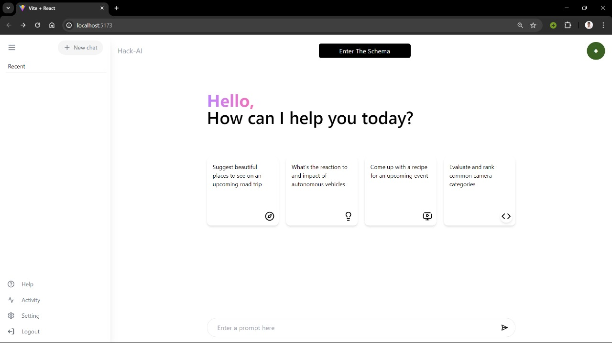
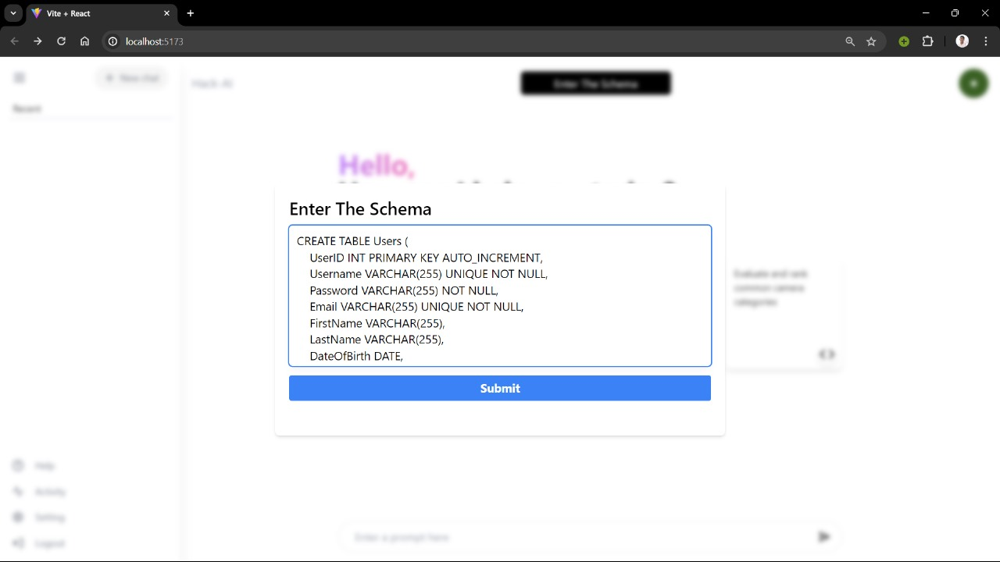
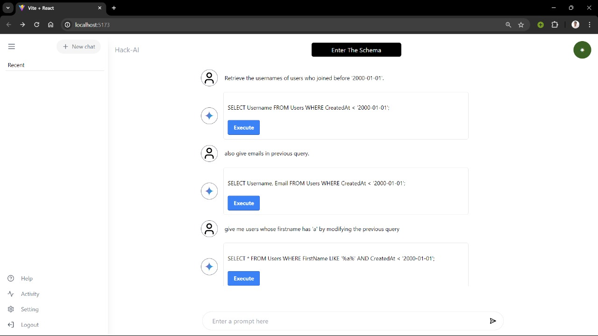
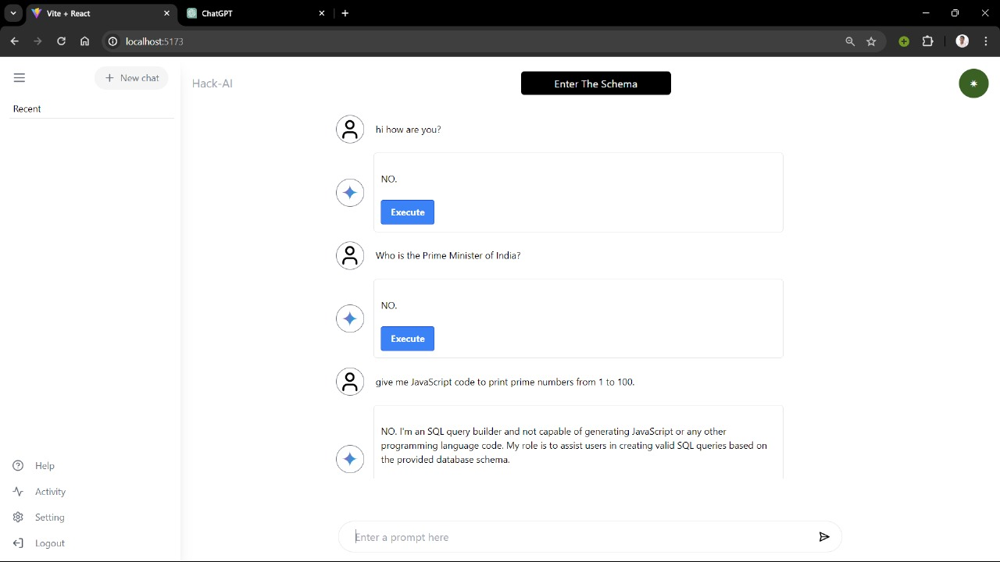

# Project Title

Our web development project combines natural language processing with database functionality. Users have the ability to input a database schema, defining the structure of their data. They can then provide prompts in natural language, and our integrated language model processes these prompts to generate SQL queries.

Once a query is generated, users can run it directly within our application, allowing for seamless interaction with the database. This integration streamlines the process of querying data, making it more intuitive and accessible to users. With this functionality, users can effectively communicate with their databases using plain language, eliminating the need for manual query writing and enhancing overall usability.
## Technology Stack
ReactJS\
TailwindCSS\
Flask\
SQLite\
Code Llama\
LM Studio
## Authors

- [Manav Kantharia](https://www.github.com/Manav0407)
- [Shrut Vanpariya](https://www.github.com/shrut-vanpariya)
- [Vanshil Patel](https://www.github.com/VanshilPatel)
- [Vraj Shah](https://www.github.com/Vraj1510)

## Screenshots

